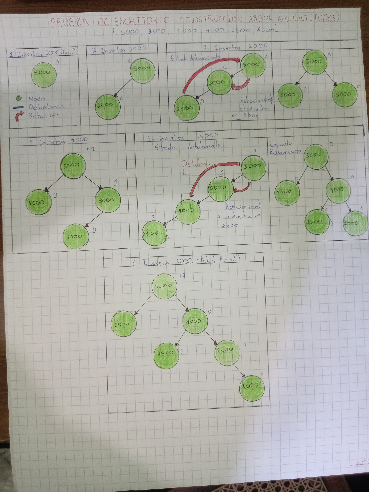

# Informe del Proyecto: Motor de Radar Aéreo (AVL)

## Fase 1: Documentación de Memoria en Rust
Para este proyecto se aplicaron dos conceptos críticos de la gestión de memoria de Rust:

1. **Uso de Box<Nodo>:** En Rust, los tipos recursivos (como un árbol) necesitan un tamaño conocido en tiempo de compilación. Usamos `Box` para mover el nodo al **Heap**, dejando un puntero de tamaño fijo en el Stack.
2. **Uso de Option::take():** Se utilizó para extraer el valor de un `Option` (el nodo) dejando un `None` en su lugar. Esto permite cumplir con las reglas de **Ownership** de Rust al mover nodos durante las rotaciones sin violar el acceso a la memoria.

## Prueba de Escritorio (Inserciones y Rotaciones)
Se realizó el seguimiento de las altitudes: [5000, 3000, 2000, 4000, 3500, 6000].

1. **Insertar 5000, 3000, 2000:** Genera un desbalance a la izquierda. Se aplica **Rotación Simple a la Derecha**.
2. **Insertar 4000, 3500:** Genera un desbalance en el subárbol. Se aplica **Rotación Simple a la Derecha**.
3. **Insertar 6000:** El árbol queda balanceado con altura 3.

## Funcionalidades Implementadas
- **Fase 2:** Búsqueda eficiente de vuelos por altitud (O(log n)).
- **Fase 3:** Sistema de aterrizaje (eliminación de nodos) con rebalanceo automático.
- **Fase 4:** Reporte de estadísticas (vuelos totales, altitud mínima y máxima).